# cloudrun 🏃🌩️
cloudrun : Managed Compute Platform # Cloud Run # Serverless # Stateless # Container

## Objective
- Enable Cloud Run API.
- Create simple Node.js application that can be deployed as a serverless, stateless container.
- Containerize your application and upload to Artifact Registry.
- Deploy containerized application on Cloud Run.
- Delete unneeded images to avoid incurring extra storage charges.

## Deploy Serverless & Stateless Node JS Application Container on Cloud Run 

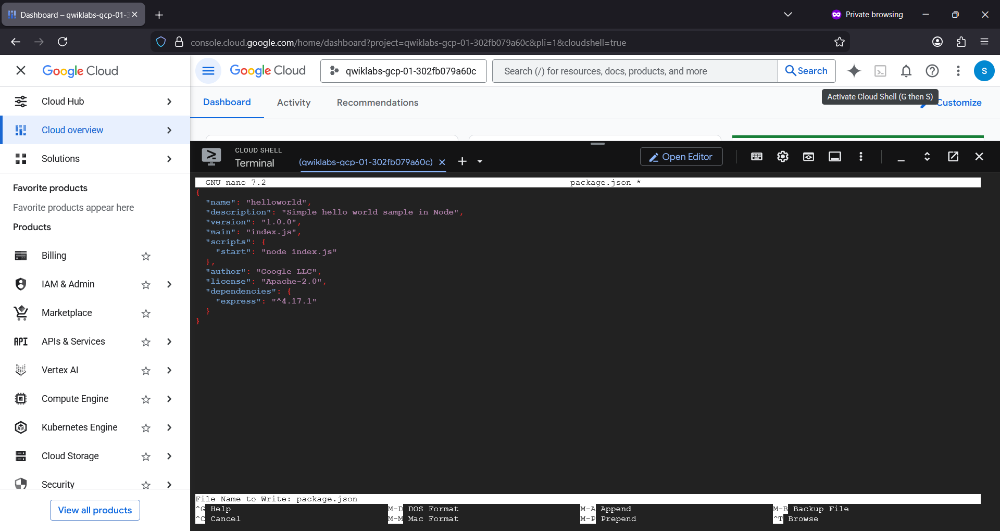

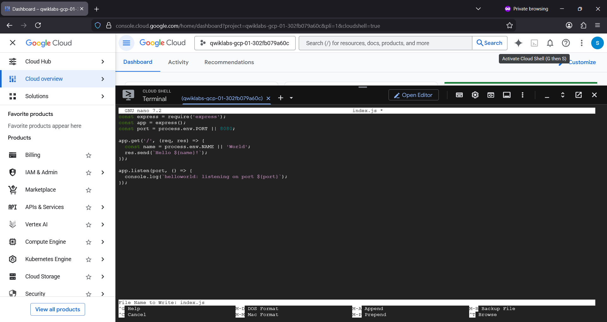

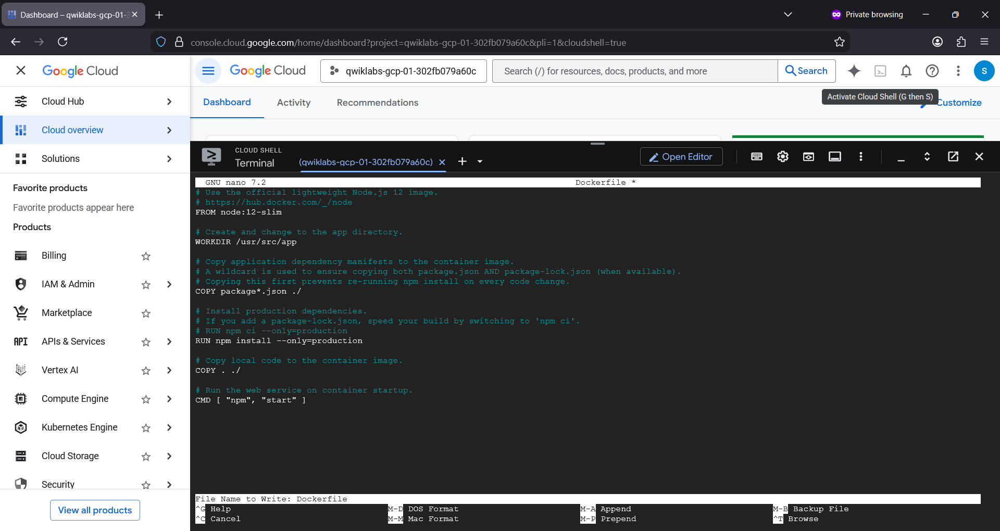

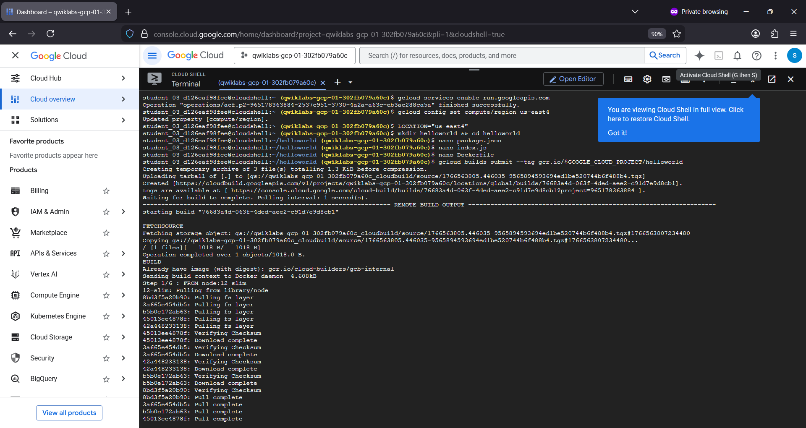

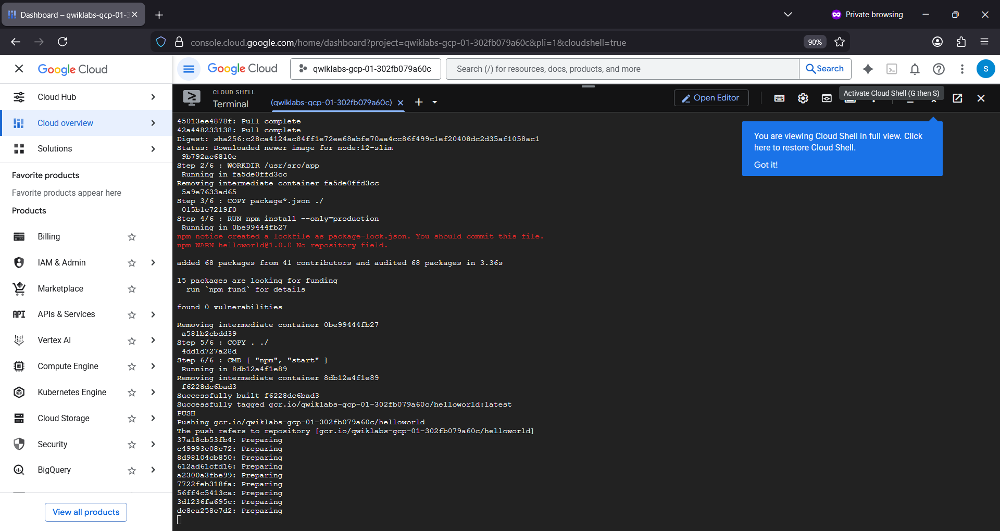

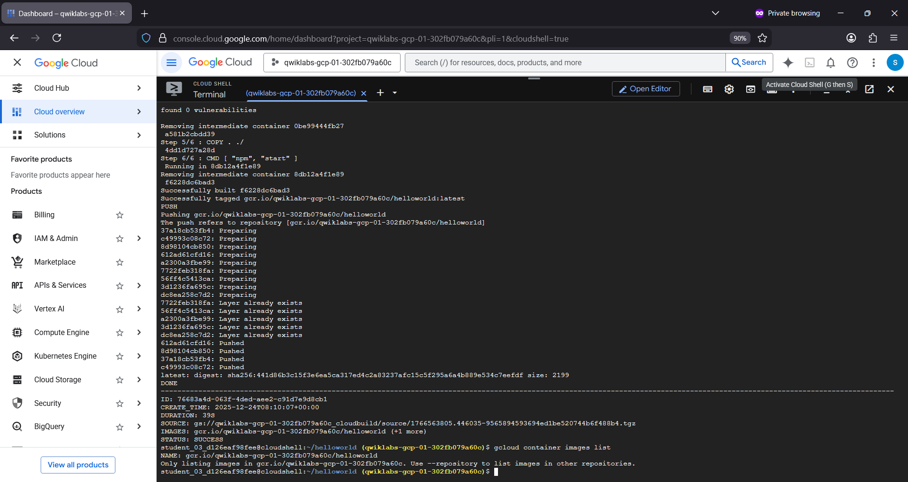

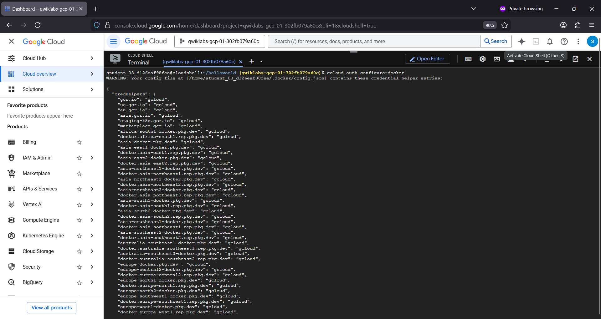

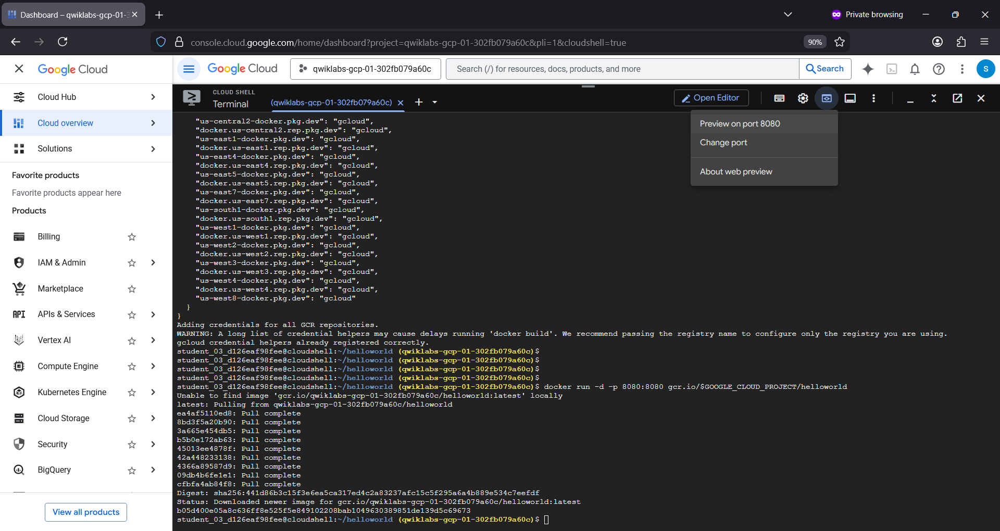

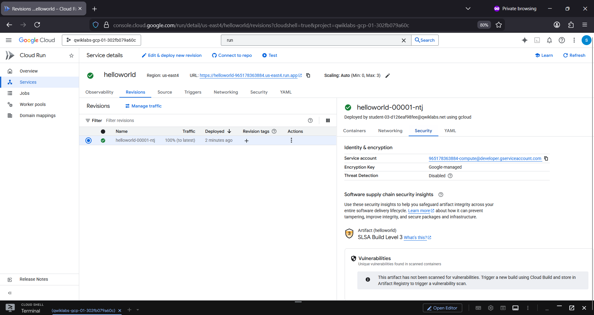

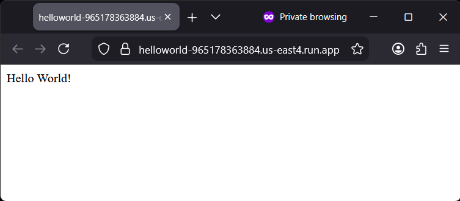

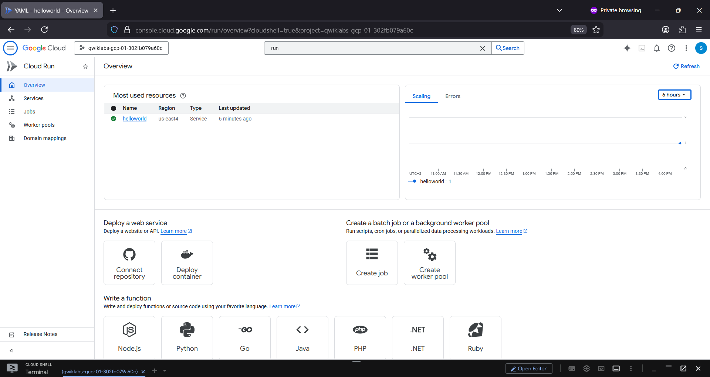

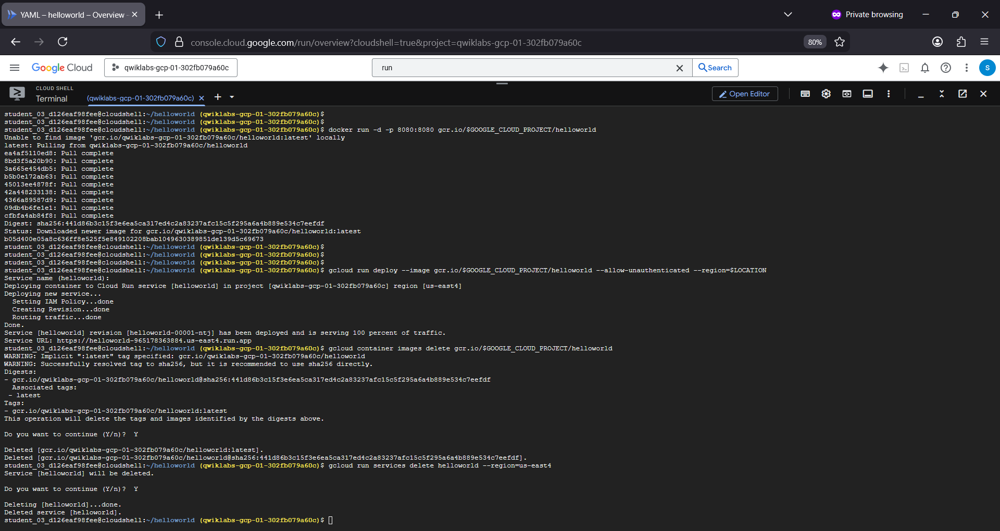

